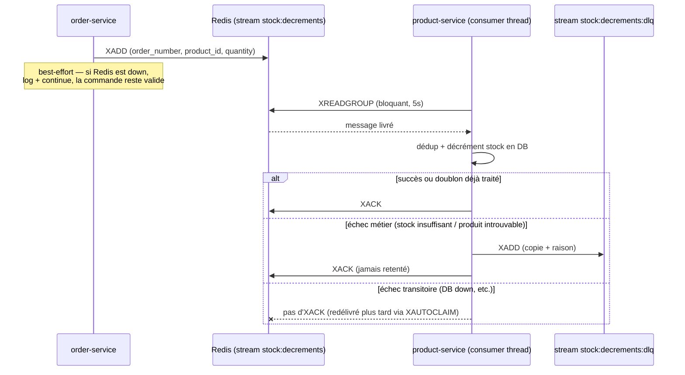

# Résilience du décrément de stock avec Redis Streams

Ce document explique en détail l'amélioration apportée à Billcom pour que la mise à
jour du stock survive à une panne temporaire de `product-service`, comment ça
fonctionne, tout ce qui a été ajouté dans le code, et le test de panne simulée
réalisé pour valider le mécanisme en conditions réelles sur le cluster.

---

## 1. Le problème initial

Avant cette amélioration, quand une commande était confirmée (paiement à la
livraison, ou paiement Stripe validé), `order-service` appelait `product-service`
en HTTP **synchrone** pour décrémenter le stock :

```
order-service  --PATCH /api/v1/products/{id}/stock-->  product-service
```

Cet appel était "best-effort" : si `product-service` était injoignable au moment
de l'appel (redémarrage, crash, déploiement en cours...), l'erreur était juste
loguée et **la mise à jour du stock était perdue définitivement**. La commande
restait confirmée, mais le stock affiché ne reflétait plus la réalité — aucune
rattrapage automatique n'existait.

C'est le point faible que cette amélioration corrige.

---

## 2. Pourquoi Redis Streams plutôt que Kafka

La demande initiale était "une solution façon Kafka pour survivre à une panne
de service". Kafka a été écarté pour ce projet :

| | Kafka | Redis Streams (retenu) |
|---|---|---|
| Nouvelle infra à déployer | Oui (broker + Zookeeper/KRaft) | Non — Redis est déjà présent (cache de commandes) |
| RAM/CPU supplémentaire | Significatif | Négligeable |
| Complexité opérationnelle | Élevée (partitions, offsets, schémas) | Faible (une poignée de commandes Redis) |
| Adapté à un projet solo-dev sur Minikube | Non | Oui |

Redis Streams offre les mêmes primitives essentielles (log d'événements
persistant, groupes de consommateurs, accusé de réception, redélivrance) sans
ajouter le moindre service au cluster — le `redis:7-alpine` déjà utilisé pour le
cache des commandes sert aussi de bus d'événements.

---

## 3. Comment fonctionne Redis Streams (les concepts)

Un **Stream** Redis est un log d'événements append-only, un peu comme une table
de commit-log :

- **`XADD stream * champ1 val1 champ2 val2`** — ajoute une entrée avec un ID
  auto-généré (horodatage). L'entrée reste dans le stream même après avoir été
  traitée (contrairement à une queue classique) — c'est un historique.
- **Groupe de consommateurs (`XGROUP CREATE`)** — permet à un ou plusieurs
  processus de lire le même stream *sans se marcher dessus* : chaque message
  n'est délivré qu'à un seul consommateur du groupe.
- **`XREADGROUP ... BLOCK 5000`** — un consommateur lit les nouveaux messages
  (`>`), en bloquant jusqu'à 5s s'il n'y en a pas. Le message reçu passe dans la
  **PEL** (Pending Entries List) du groupe : délivré, mais pas encore acquitté.
- **`XACK`** — le consommateur confirme avoir traité le message ; il sort de la
  PEL.
- **`XPENDING`** — liste les messages délivrés mais jamais acquittés (crash du
  consommateur en plein traitement, par exemple).
- **`XAUTOCLAIM`** — réclame les messages restés trop longtemps dans la PEL
  d'un autre consommateur (mort/redémarré) pour les retraiter. C'est ce qui
  donne la résilience : un message n'est jamais perdu, seulement "en retard".

En résumé : **tant que Redis tourne, un événement publié est garanti d'être
traité tôt ou tard**, même si le service qui doit le consommer est down au
moment de la publication.

---

## 4. Architecture mise en place pour Billcom



**Primitives utilisées :**

| Élément | Nom |
|---|---|
| Stream principal | `stock:decrements` |
| Groupe de consommateurs | `product-service-stock` |
| Stream dead-letter (échecs métier définitifs) | `stock:decrements:dlq` |
| Granularité | une entrée `XADD` **par article** de la commande (pas un JSON par commande) |
| Clé de déduplication | `stockevt:{order_number}:{product_id}` (TTL 24h) |

**Ce qui reste inchangé, volontairement :** la vérification du prix/stock
**avant** paiement (`_fetch_product` dans `order-service`) reste un appel HTTP
synchrone et *fail-closed* — si `product-service` est injoignable à ce
moment-là, la commande échoue explicitement. On ne veut jamais accepter un
paiement sur un prix ou un stock qu'on n'a pas pu vérifier. Seul le
**décrément** (l'écriture différée, après confirmation de la commande) passe
par la queue.

---

## 5. Détail de ce qui a été ajouté

### `services/order-service/app/main.py` — le producteur

- `redis_client` (déjà existant pour le cache des commandes) est réutilisé.
- Nouvelle fonction `_publish_stock_decrement(order_number, items)` qui
  remplace l'ancien `_decrement_stock` (appel HTTP `requests.patch`). Elle
  publie une entrée `XADD` par article :
  ```python
  redis_client.xadd(
      "stock:decrements",
      {"order_number": order_number, "product_id": str(item_id), "quantity": str(item_qty)},
  )
  ```
  Si Redis est indisponible, l'erreur est loguée et la commande reste valide
  (même philosophie "best-effort" que l'ancien code, juste avec un point de
  défaillance en moins : Redis est presque toujours plus disponible qu'un
  service applicatif spécifique).
- Appelée à 3 endroits, chacun protégé par la garde d'idempotence déjà
  existante côté commande (`order.status == "pending"` avant de passer à
  `"processing"`) :
  - `create_order` (paiement à la livraison, juste après confirmation)
  - `verify_stripe_payment` (paiement Stripe confirmé via polling)
  - `stripe_webhook` (paiement Stripe confirmé via webhook)

### `services/product-service/app/main.py` — le consommateur

- Ajout d'un client Redis (`redis_client`), identique au pattern d'order-service.
- **Logique de mutation extraite** dans `_apply_stock_decrement(db, product_id, quantity)`,
  utilisée à la fois par l'endpoint HTTP existant (`PATCH /api/v1/products/{id}/stock`,
  toujours là pour un usage manuel/interne direct) et par le consumer — un seul
  endroit qui sait décrémenter du stock, pas de duplication de logique.
- `_process_stock_event(db, order_number, product_id, quantity)` — la fonction
  pure qui traite un événement : vérifie la déduplication (`SET ... NX EX 86400`),
  applique le décrément, et route vers le DLQ si l'échec est définitif (produit
  introuvable / stock insuffisant). Retourne `True`/`False` pour dire si le
  message doit être acquitté ou laissé en attente.
- `_consume_stock_events()` — la boucle de consommation : `XAUTOCLAIM` (récupère
  les messages bloqués depuis plus de 30s) puis `XREADGROUP` (bloquant, 5s),
  avec un backoff exponentiel (1s → 30s max) en cas d'erreur (ex. Redis
  temporairement injoignable).
- Cette boucle tourne dans un **thread daemon** démarré au lancement de
  l'application (`@app.on_event("startup") def start_stock_consumer()`), le
  même style que le hook de seed des produits déjà présent. Pas de nouveau
  Deployment Kubernetes, pas de nouvelle dépendance (Celery, etc.) — juste un
  thread qui bloque sur des appels Redis.

### Configuration et infrastructure

- `REDIS_HOST` / `REDIS_PORT` ajoutés à `services/product-service/app/config.py`
  (product-service n'avait jusqu'ici jamais parlé à Redis).
- `redis==5.0.4` ajouté à `services/product-service/requirements.txt` (même
  version que order-service).
- `docker-compose.yml` : `REDIS_HOST=redis` / `REDIS_PORT=6379` ajoutés au
  bloc `environment` de `product-service`.
- `k8s/base/product-service.yaml` : mêmes variables câblées via
  `configMapKeyRef` vers `billcom-config` (qui les avait déjà, order-service
  les utilisait déjà).

### Tests ajoutés

- **order-service** (`tests/test_order.py`) : publication de l'événement au
  bon format, résilience si Redis échoue ou est absent, publication une seule
  fois même si `/stripe/verify` est appelé deux fois.
- **product-service** (`tests/test_product.py`) : `_apply_stock_decrement`
  seul (succès / stock insuffisant / produit introuvable), `_process_stock_event`
  (application + déduplication, échec métier → DLQ, échec transitoire → clé
  de dédup libérée pour permettre un retry). Tout est testé sans thread ni
  vrai Redis, en mockant `app.main.redis_client`.
- **48 tests passent** au total (20 order-service + 28 product-service).

---

## 6. Ce que ça apporte concrètement à la plateforme

1. **Plus de perte de stock silencieuse** — une panne de `product-service`
   (crash, redéploiement, `CrashLoopBackOff`) ne fait plus perdre de
   décréments : ils attendent dans Redis et sont appliqués au retour.
2. **Idempotence garantie** — même si un message est redélivré (crash du
   consumer en plein traitement), la clé de dédup empêche un double
   décrément.
3. **Visibilité sur les échecs métier** — un produit supprimé entre-temps ou
   un stock réellement insuffisant part dans `stock:decrements:dlq` au lieu
   de disparaître dans un log ; on peut l'inspecter (`XRANGE stock:decrements:dlq - +`).
4. **Découplage temporel** — `order-service` et `product-service` n'ont plus
   besoin d'être disponibles exactement au même instant pour que le stock
   reste cohérent.
5. **Zéro nouvelle infrastructure** — aucune image supplémentaire à builder,
   aucun nouveau Deployment/Service Kubernetes, aucune nouvelle dépendance
   lourde.

**Contrepartie assumée** (validée avec l'utilisateur) : le stock n'est plus
décrémenté de façon strictement synchrone à la confirmation de commande — il y
a un délai (généralement <1s, jusqu'à ~5s dans le pire cas, le temps du
`XREADGROUP BLOCK`). C'est un compromis volontaire : remplacer entièrement le
chemin HTTP par la queue (plutôt qu'un hybride HTTP + fallback queue) élimine
tout risque de double-décrément.

---

## 7. Simulation de panne réalisée

### C'est quoi cette panne ?

On simule une coupure de `product-service` **après** qu'une commande a été
confirmée mais **avant** que l'événement de décrément ait été consommé — le
scénario exact que ce mécanisme est censé couvrir.

Deux contraintes ont guidé la méthode de test :

- On ne peut pas juste couper `product-service` puis passer une commande
  normalement : la vérification de prix/stock (`_fetch_product`, restée
  volontairement synchrone et fail-closed) ferait échouer la commande *avant*
  même d'atteindre la publication de l'événement. Ce n'est pas ce qu'on veut
  tester.
- Le test le plus fiable et reproductible consiste donc à **injecter
  manuellement un événement dans le stream Redis** pendant que
  `product-service` est à 0 réplique — ça simule exactement "une commande a
  été confirmée juste avant la panne, l'événement est en attente" sans
  dépendre d'un timing parfait.

### Étapes et commandes utilisées

**1. Relevé du stock de référence** (produit `id=1`, iPhone 15 Pro Max) :
```bash
curl -sk https://localhost:8443/api/v1/products/1 | grep -o '"stock":[0-9]*'
```
→ `"stock":44`

**2. Simulation de la panne** — on met `product-service` à 0 réplique :
```bash
kubectl scale deployment/product-service -n billcom --replicas=0
```

**3. Injection manuelle de l'événement** (simule une commande de 3 unités
confirmée juste avant la panne) :
```bash
kubectl exec -it deploy/redis -n billcom -- redis-cli XADD stock:decrements '*' \
  order_number GZ-PANNE-TEST-2 product_id 1 quantity 3
```
→ `"1785313954451-0"` (l'ID généré par Redis pour l'entrée)

**4. Retour en ligne de product-service :**
```bash
kubectl scale deployment/product-service -n billcom --replicas=1
kubectl rollout status deployment/product-service -n billcom
```

**5. Vérification du résultat** (quelques secondes après le rollout) :
```bash
curl -sk https://localhost:8443/api/v1/products/1 | grep -o '"stock":[0-9]*'
kubectl exec -it deploy/redis -n billcom -- redis-cli XPENDING stock:decrements product-service-stock
```

### Résultats obtenus

| Vérification | Attendu | Obtenu |
|---|---|---|
| Stock après retour en ligne | 44 − 3 = **41** | **41** ✓ |
| `XPENDING` (messages non acquittés) | **0** | **0** ✓ |

Le pod `product-service` a bien redémarré son thread consumer au lancement
(`@app.on_event("startup") → start_stock_consumer`), a réclamé le message en
attente via `XAUTOCLAIM`/`XREADGROUP`, appliqué le décrément une seule fois, et
acquitté (`XACK`) — sans aucune intervention manuelle après le retour en ligne.

### Incident rencontré pendant le test (et corrigé)

Le tout premier test a révélé un vrai bug : `XAUTOCLAIM` était appelé avec le
mauvais nom de paramètre (`start=` au lieu de `start_id=`, spécifique à
l'API `redis-py`), ce qui faisait boucler le consumer en erreur toutes les
quelques secondes sans jamais traiter les messages. Corrigé, testé, redéployé
avant de rejouer le test avec succès. Un deuxième incident (sans lien avec le
code) a aussi été résolu : `kubectl rollout restart` ne réapplique pas un
fichier YAML modifié localement — il a fallu `kubectl apply` puis committer et
pousser les changements pour qu'ArgoCD (en mode `selfHeal`) cesse d'annuler la
modification manuelle.

---

## 8. Commandes utiles pour la suite

Consulter le contenu du dead-letter stream (échecs métier définitifs) :
```bash
kubectl exec -it deploy/redis -n billcom -- redis-cli XRANGE stock:decrements:dlq - +
```

Voir l'état du groupe de consommateurs (lag, dernier ID livré, etc.) :
```bash
kubectl exec -it deploy/redis -n billcom -- redis-cli XINFO GROUPS stock:decrements
```

Voir les messages actuellement en attente d'accusé de réception :
```bash
kubectl exec -it deploy/redis -n billcom -- redis-cli XPENDING stock:decrements product-service-stock
```

Purger l'historique du stream (les entrées de test, par exemple) sans
supprimer le stream ni le groupe :
```bash
kubectl exec -it deploy/redis -n billcom -- redis-cli XTRIM stock:decrements MAXLEN 0
```

---

## 9. Autres améliorations livrées dans la même session

En plus de la résilience du stock, deux autres ajouts backend ont été faits
et testés en parallèle :

- **`GET /api/v1/orders/frequently-bought-with/{product_id}`** — retourne les
  produits qui apparaissent le plus souvent dans les mêmes commandes qu'un
  produit donné (comptage de co-occurrence sur `items_json`), utilisable pour
  des recommandations "fréquemment achetés ensemble" côté frontend (pas
  encore branché à l'UI).
- **Authentification service-à-service** (`X-Internal-Service-Key`) pour
  protéger l'endpoint `PATCH /api/v1/products/{id}/stock` — garantit que seul
  un service interne (pas un client public) peut modifier le stock
  directement.
- **16 nouveaux produits** ajoutés au catalogue (2 par catégorie), avec un
  stock généreux (55 à 300 unités), pour enrichir la démo.
